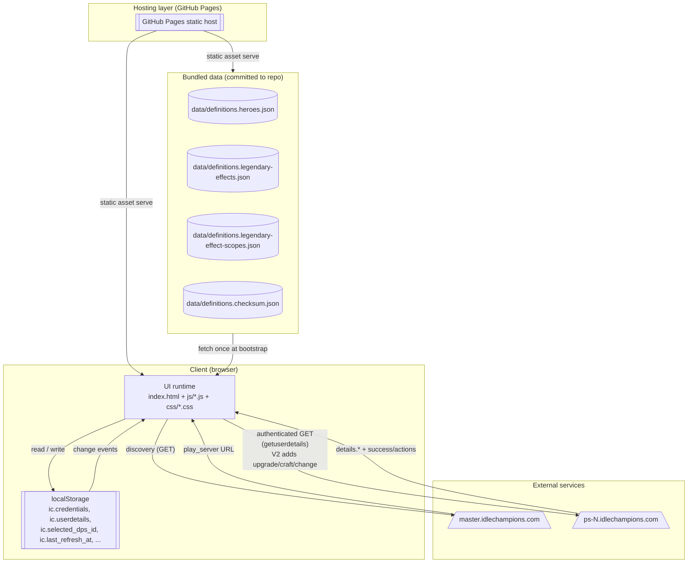
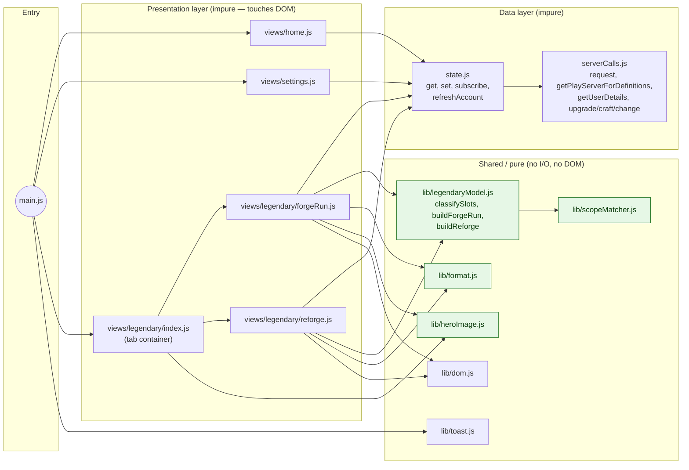
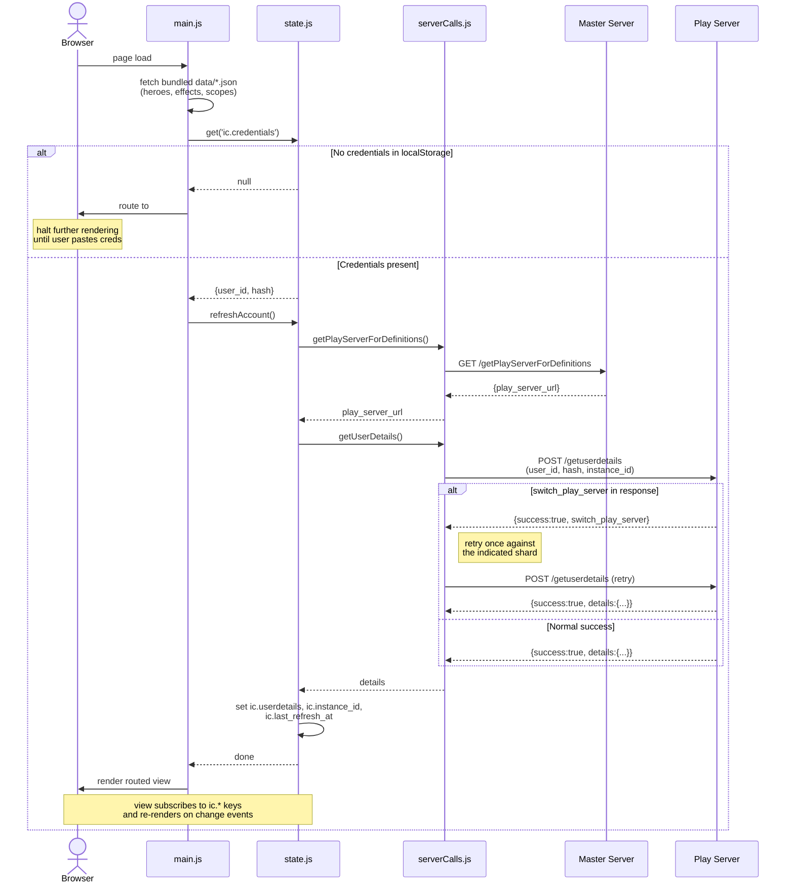
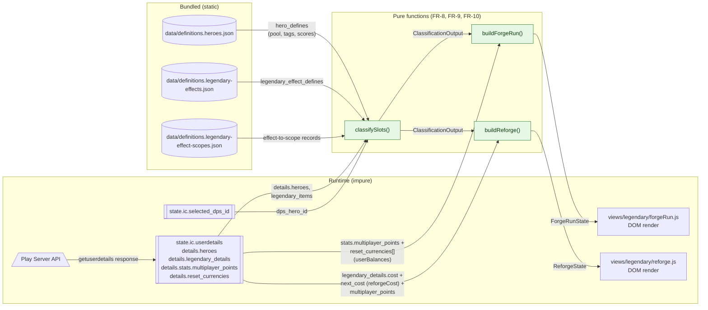

# Idle Champions — Legendary View & App Foundation: Technical Design

**Project:** Idle Champions GitHub Pages companion — Legendary Items (Forge Run + Reforge tabs, PRD §3.2)
**Version:** 0.2 (Draft — all sections drafted)
**Last Updated:** 2026-04-24
**Author(s):** Chetan Desai

---

## Status

**All sections drafted.** §§1-7 plus Appendix A (Glossary), B (Resolved Decisions), and C (References) are complete. This document is deliberately scope-bound to the **Legendary view runtime + the shared app-foundation contracts it exercises** — Specializations (PRD §3.3), Settings/credential-entry UX details, and all future categories are explicitly out of scope.

**V1 is read-only** (PRD §9 decision 18, Appendix B #12): the site plans the Forge Run / Reforge session; the player performs the upgrades in-game and taps the global **Refresh** button to re-hydrate. §§5-7 diagram only the flows that exist in V1 (bootstrap + refresh + `switch_play_server` retry) — the mutation sequence diagrams (earlier FR-11, FR-12) were removed when the read-only decision landed; the `serverCalls.js` mutation helpers ship as library-level exports for V2.

Appendix B captures the pre-draft resolved decisions (12 items, all Resolved as of 2026-04-24) that §§1-7 cite rather than re-litigating.

Implementation has started: `js/lib/scopeMatcher.js`, `js/lib/legendaryModel.js`, `js/lib/format.js`, `js/lib/heroImage.js`, `js/serverCalls.js`, `js/credentials.js`, `js/state.js`, `js/views/settings.js`, and `js/main.js` are landed with `node:test` coverage. Bundled definitions include `data/definitions.hero-images.json` (Emmote's `ic_wiki` portrait slugs, Appendix B #9). The remaining work is the two Legendary tab views and the Home dashboard.

Related documents:
- [PRD](PRD.md) — product requirements, Legendary Items UX (§3.2 — Forge Run §3.2.4 ships first, Reforge §3.2.5 follows)
- [API reference](server-calls.md) — play-server endpoint contracts
- [getlegendarydetails sample](getlegendarydetails.sample.json) — scrubbed raw response
- [Enriched legendary sample](getlegendarydetails.enriched.sample.json) — scrubbed, joined with definitions

---

## 1. Problem Statement

### Problem

Idle Champions players tune their account's DPS by upgrading legendary items on champions that either *are* the DPS or *buff* the DPS (via race/gender/alignment/damage-type/stat-threshold scoped effects). The in-game UI surfaces legendaries one champion at a time, buries cost/eligibility behind multiple taps, and never tells you *"which legendary upgrade gives the most DPS per favor spent right now?"* Answering that requires joining state from multiple API endpoints, a scope-matching step that parses human-readable effect descriptions into machine-readable targeting rules, and a prioritization pass — none of which the game client does for the player.

The scope-matching step specifically has no API-native solution. Legendary effect descriptions like *"Increases the damage of all Female Champions by $(amount)%"* or *"Increases the damage of all Champions with an INT score of 11 or higher"* must be parsed and matched against a hero's static attributes (race/gender/alignment/damage-type/ability-scores). Without a helper, the player has to do that matching in their head across every legendary on every owned champion — which caps useful decision-making well below the player's roster size.

A second implicit problem: the same API surface (`getuserdetails`) carries everything the client needs for Legendary, Specializations, and every future category view, but an ad-hoc "one-off fetch per view" pattern fragments retry logic, credential handling, and the `switch_play_server` dance across the codebase. Settling those contracts once — as part of the first category view to use them — is cheaper than retrofitting them after three views already speak to the API differently.

### Value

- **For the player:** a DPS-first ranked view of upgrade candidates that answers *"where should I spend the favor I just earned?"* in one glance, on mobile, without opening the game client. Reforge tab does the same for the time-gated Scales-of-Tiamat reroll decision. Classifications are deterministic and transparent — a chip row shows exactly which hero attributes are driving the "affects DPS" verdict.
- **For the site's future categories (Specializations and beyond):** a settled foundation — `serverCalls.js` with unified retry + typed errors, `state.js` pub/sub store over localStorage, bootstrap + credential gate, pessimistic mutation wrapper — so the second category view is an incremental add, not a second round of architecture debate.
- **For the author maintaining this repo:** a pure-functional core (`scopeMatcher.js`, `legendaryModel.js`) that's testable under `node:test` with hardcoded fixtures; UI code stays thin and the high-value logic has regression coverage.

### Scope

This design specifies the **Legendary View** of the [Idle Champions GitHub Pages companion site](PRD.md) — a zero-backend static web app with two tabs sharing a single DPS selector:

- **Forge Run (V1 priority)** — deterministic planner ranked by per-campaign favor, showing every DPS-affecting legendary currently upgradeable with both its Scales-of-Tiamat and favor cost. Read-only: the player upgrades in-game and taps Refresh (PRD §3.2.4, §9 decision 18).
- **Reforge (ships after Forge Run)** — probabilistic planner for supporting heroes whose pools contain DPS-affecting effects, gated by the account-wide Scales-of-Tiamat reforge cost. Read-only, same Refresh loop (PRD §3.2.5, §9 decision 18).

It also specifies the **app foundation** both tabs exercise (server-call plumbing, state store, credential gate, refresh UX). Specializations (PRD §3.3), settings-panel UX beyond the credential gate, and all future categories listed in PRD §11 are explicitly out of scope — they will reuse the foundation specified here without amendment.

The full UX spec lives in PRD §3.2; all design decisions behind the contracts below are resolved in [Appendix B](#appendix-b-resolved-decisions--open-questions) and cited inline rather than re-litigated.

---

## 2. Functional Requirements

Each FR is a one-sentence statement of what the system must do, paired with the concrete module/function that delivers it and a pointer to the Appendix B row that fixed the design decision. Modules marked *(new)* do not yet exist in the repo; everything else is either partially in place or scaffolded.

### 2.1 App-foundation FRs (shared across all category views)

| FR  | Requirement | Delivered by | Decision ref |
|-----|-------------|--------------|--------------|
| **FR-1** | All play-server HTTP traffic goes through a single module that centralizes boilerplate injection, credential injection, `switch_play_server` retry (exactly once, even on `success:true`), and failure normalization into a typed `ApiError { kind, status?, message, raw }`. No `.success` checks or retry logic leak into views. | `js/serverCalls.js` — private `request(method, params)` helper + named public functions. **V1 reads:** `getUserDetails`, `getPlayServerForDefinitions`. **Library-only, not wired in V1 UI** (Appendix B #12, PRD §9 decision 18): `upgradeLegendaryItem`, `craftLegendaryItem`, `changeLegendaryItem`. *(`getLegendaryDetails` is deliberately absent — see FR-4.)* | [Appendix B #1, #12](#appendix-b-resolved-decisions--open-questions) |
| **FR-2** | Application state is persisted in `localStorage` as the single source of truth and exposed to views via a tiny pub/sub store with `get(key)`, `set(key, val)`, `subscribe(key, callback)`. Keys namespaced `ic.*`. No TTL, no auto-expiry, no background polling — staleness is user-driven. | `js/state.js` *(new)* | [Appendix B #2](#appendix-b-resolved-decisions--open-questions) |
| **FR-3** | On startup, the app loads bundled `data/*.json` synchronously, checks `ic.credentials`, routes to `#/settings` (blocking all other routes) if absent, and once credentials exist runs `refreshAccount()` before rendering the routed view. A global header always shows "Last refreshed: Xm ago" with a refresh icon-button. | `js/main.js` *(new)* bootstrap + route guard | [Appendix B #3](#appendix-b-resolved-decisions--open-questions) |
| **FR-4** | A single `refreshAccount()` function is the only entry point for hydrating account state. It calls `getuserdetails` exactly once and writes the entire legendary view's input data (`details.heroes`, `details.loot`, `details.legendary_details`, `details.stats.multiplayer_points`, `details.reset_currencies`, `details.instance_id`) through to the state store. Both the Refresh button and post-mutation flows call this same function. | `js/state.js` `refreshAccount()` + `js/serverCalls.js` `getUserDetails()` | [Appendix B #2, #8](#appendix-b-resolved-decisions--open-questions) |
| **FR-5** | **Refresh UX.** The global header's Refresh button disables + spins while `refreshAccount()` is in flight. On success, `ic.last_refresh_at` updates, subscribed views re-render, and a transient success toast confirms the refresh. On failure, the server's `failure_reason` (or HTTP/network message) surfaces via a toast, the button re-enables, and cached state remains untouched. Same toast component is used wherever post-action feedback matters. V1 is read-only (Appendix B #7, #12, PRD §9 decision 18), so there is no mutation-specific UX surface in scope. | `js/main.js` (header wiring, already landed) + `js/lib/toast.js` *(new)* | [Appendix B #7, #12](#appendix-b-resolved-decisions--open-questions) |
| **FR-6** | Rate limiting: V1 does not apply explicit client-side throttling beyond the existing 4-retry cap in `serverCalls.js`. Mutation UX is sequential-by-construction (one button, disabled while in flight), which naturally prevents accidental bursts. If PRD §10 Q4 ever surfaces a documented per-account limit, add a token bucket inside `request()`. | `js/serverCalls.js` `request()` — existing retry cap; no added throttle in V1 | PRD §10 Q4 (V1 punt) |

### 2.2 Legendary-view FRs

| FR   | Requirement | Delivered by | Decision ref |
|------|-------------|--------------|--------------|
| **FR-7** | The Legendary view renders as a single card with two tabs (Forge Run, Reforge) sharing a DPS dropdown, a five-axis classification chip row (Race · Gender · Alignment · Damage-type · top ability scores), and a sticky Scales-of-Tiamat balance badge. The last-selected DPS (`ic.selected_dps_id`) and tab (`ic.legendary.activeTab`, default `forge-run`) are restored on mount. No tab content renders until a DPS is picked. **DPS dropdown ordering:** alphabetical by hero name; entries filtered to heroes the player owns *and* that carry the `"dps"` tag in `definitions.heroes.json` (Appendix B #11). Hero portraits in the dropdown and tiles resolve via `heroImageUrl(heroId, heroImages)` from `data/definitions.hero-images.json`, falling back to the first-word monogram when a slug is missing (Appendix B #9). | `js/views/legendary/index.js` *(new)* — shell + tab switcher; `js/views/legendary/header.js` *(new)* — DPS selector + chip row + balance badge | PRD §3.2.3, §9 #16–#17; [Appendix B #9, #11](#appendix-b-resolved-decisions--open-questions) |
| **FR-8** | For the selected DPS, the system computes — once per DPS change, memoized in session — a classification of every equipped legendary slot against the DPS: `{heroId, slotIndex, currentEffectId, affectsDps, heroRole, poolAffectingDps[], equippedLevel, requiredFavor}`. Classification uses `scopeMatcher.effectAffectsHero()` against the bundled scope table. **Memoization shape (Appendix B #10):** the memo is a `Map<dpsHeroId, SlotClassificationMap>` held inside `js/views/legendary/index.js`; a `state.subscribe('ic.userdetails', …)` callback clears the entire map whenever account state refreshes. This keeps `classifySlots` itself pure and moves all cache-management concerns into the view layer. | `js/lib/legendaryModel.js` *(new)* `classifySlots(inputs)` — pure; consumes bundled `definitions.heroes.json` + `definitions.legendary-effects.json` + `definitions.legendary-effect-scopes.json` + `details.legendary_details.legendary_items` + selected DPS id. | [Appendix B #4, #5a, #10](#appendix-b-resolved-decisions--open-questions); PRD §3.2.2 |
| **FR-9** | The Forge Run tab renders the classification as: (a) a privileged DPS-hero row (all 6 slots always affecting), (b) a list of supporting hero cards where `affectsDps === true` for ≥1 slot, (c) a favor-priority panel ranked by count-of-upgradeable-now-DPS-affecting-slots per favor currency. A slot is "upgradeable now" iff `level < 20 && scales ≥ upgrade_cost && favor ≥ upgrade_favor_cost` — where `scales = stats.multiplayer_points` and `favor = reset_currencies[].current_amount` looked up by `reset_currency_id`. Both cost components must be displayed on every upgrade-related surface. `upgrade_favor_required` is never consulted. | `js/lib/legendaryModel.js` `buildForgeRun(classification, userBalances) → ForgeRunState`; `js/views/legendary/forgeRun.js` *(new)* | [Appendix B #4, #6](#appendix-b-resolved-decisions--open-questions); PRD §3.2.4 |
| **FR-10** | The Reforge tab renders: (a) an account-level banner with the current `cost` / `next_cost` / `reforge_reduction_time` scalar values from `legendary_details`, (b) a list of supporting heroes where at least one equipped slot does not affect DPS *and* the hero's 6-effect pool contains ≥1 DPS-affecting effect. Each reforge candidate tile carries an `X/Y hits` badge computed per the Phase-1/Phase-2 formulas: `U = ⋃ effects_unlockedᵢ`, `A = P ∩ effectsAffectingDps`; Phase 1 (`|U| < 6`) → `X = |(P\U) ∩ A|`, `Y = 6 − |U|`; Phase 2 → `X = |A|`, `Y = 6`. | `js/lib/legendaryModel.js` `buildReforge(classification, reforgeCost) → ReforgeState`; `js/views/legendary/reforge.js` *(new)* | [Appendix B #4, #5a, #5b, #5c](#appendix-b-resolved-decisions--open-questions); PRD §3.2.5 |
| **FR-11** | *(V2-deferred — was "Upgrade action")* Per Appendix B #12 and PRD §9 decision 18, Forge Run V1 has no in-site upgrade action. Tile tooltip shows the next-upgrade cost read-only; the player upgrades in-game and taps the global Refresh button. V2 will wire `upgradeLegendaryItem()` (already exported from `serverCalls.js`) behind a `runMutation` wrapper. | *(intentionally unimplemented in V1)* | [Appendix B #7, #12](#appendix-b-resolved-decisions--open-questions) |
| **FR-12** | *(V2-deferred — was "Reforge action")* Per Appendix B #12 and PRD §9 decision 18, Reforge V1 has no in-site reforge action. Tile tooltip shows the candidate pool and banner-level cost read-only; the player reforges in-game and taps Refresh. V2 will wire `changeLegendaryItem()` (already exported) behind the same wrapper. | *(intentionally unimplemented in V1)* | [Appendix B #7, #12](#appendix-b-resolved-decisions--open-questions) |
| **FR-13** | Craft action is not implemented — the Forge Run and Reforge tabs only surface Craft as a tooltip hint on empty slots. Crafting remains in the game client (same V2 deferral as FR-11/FR-12 via Appendix B #12). | *(intentionally unimplemented)* | PRD §3.2.4, §11; [Appendix B #12](#appendix-b-resolved-decisions--open-questions) |

### 2.3 Observability & resilience FRs

| FR   | Requirement | Delivered by | Decision ref |
|------|-------------|--------------|--------------|
| **FR-14** | Classification failures (legendary effect with `scope.kind === 'unknown'`) render a banner above the Legendary card ("N effects couldn't be classified; please file an issue with the effect ID") but never block either tab. `data/definitions.checksum.json → unknown_scope_ids` is the build-time tripwire for the same condition. | `js/lib/legendaryModel.js` (surfaces unknowns in its output); `js/views/legendary/index.js` (renders banner); `scripts/refresh-defs.js` (bundle-time warning) | PRD §3.2.2, §12 success criteria |
| **FR-15** | Mutation-reflection assumption (Appendix B #8) is verified on the first **Refresh-after-in-game-upgrade** integration: the user performs an upgrade in the game client, taps Refresh, and the affected tile re-renders with the new level within one round-trip. If `getuserdetails` lags the game-client state, the Refresh flow gets a small retry-with-backoff (not a separate `getlegendarydetails` call) since the symptom will be transient rather than structural. | Manual integration check once Forge Run view lands | [Appendix B #8, #12](#appendix-b-resolved-decisions--open-questions) |

---

## 3. Non-Functional Requirements

Each NFR below is transcribed from PRD §2 or §12 and narrowed to the Legendary slice. Where the PRD already specifies a concrete target (Lighthouse thresholds, page-weight budget, etc.), the target is copied here rather than re-derived.

| ID | Requirement | Implementation |
|---|---|---|
| **NFR-1** | **Hosting & deployment.** The site ships as a static GitHub Pages deployment with no server-side code, serverless functions, or build step. All runtime lives in the browser; the repo root (or `/docs`) serves directly. | `index.html` + `js/*` + `css/*` + `data/*.json` all served as committed static assets. ES modules loaded natively via `<script type="module">`. No bundler, transpiler, or CI deploy pipeline. PRD §2.1, §9 decision 1. |
| **NFR-2** | **Browser support.** Latest two versions of Chrome / Safari / Firefox / Edge on desktop, and mobile Safari + Chrome on iOS / Android. | Vanilla ES modules, native `fetch`, `localStorage`, optional chaining, `Map` / `Set`. No polyfills, no transpilation. PRD §2.1. |
| **NFR-3** | **Performance — site shell.** Lighthouse Performance ≥ 90, Accessibility ≥ 95, Best Practices ≥ 90, SEO ≥ 80. First-load site-shell weight < 300 KB (excluding API payloads and any game-art images). | ~13 KB gzipped bundle of `data/*.json` + shell CSS/JS. No runtime dependencies. PRD §2.3, §12 success criteria. |
| **NFR-4** | **Performance — Legendary runtime.** Selecting a DPS champion resolves the full slot classification (affecting / not affecting / reforge-candidate / empty) for all 173 heroes in < 100 ms on a mid-range mobile device, using bundled `data/` only — no network. | `classifySlots` is O(heroes × slots) with O(1) scope membership tests (via pre-indexed affecting-effect-id `Set` derived from `affectingEffectIds`). Result memoized in session keyed by `selected_dps_id` + userdetails version. PRD §12 success criteria; FR-8. |
| **NFR-5** | **Accessibility.** WCAG AA color contrast, semantic HTML, ARIA landmarks, keyboard-navigable, alt text on all images. | Each view uses semantic `<main>` / `<section>` / `<nav>` landmarks, visible focus rings, tab-order matching visual order, `aria-live` region for toast announcements. PRD §2.3. |
| **NFR-6** | **Responsive design.** Mobile-first. Fully usable at a 375 px viewport with no horizontal scrolling on any view. Dense tables degrade to stacked cards on narrow screens. | CSS container queries (`@container`) on the Legendary card; the 3-column slot grid collapses to a 1-column stack under 600 px (PRD §3.2.7). Favor-priority panel becomes a disclosure accordion on mobile. PRD §2.3. |
| **NFR-7** | **Credentials & privacy.** `user_id` and `hash` stored only in browser `localStorage`; transmitted only to `*.idlechampions.com`. No telemetry, analytics, or third-party CDN requests. Explicit "Clear credentials" action available. | `js/state.js` writes `ic.credentials` to `localStorage`; `js/serverCalls.js` is the only module that makes network requests and only to the master / play-server hosts. CSP `connect-src` meta-tag restricts `fetch` destinations as defense-in-depth. Settings panel surfaces Clear-credentials. PRD §2.2, §12 success criteria. |
| **NFR-8** | **Data freshness & caching.** `localStorage` is the source of truth for account state (see Appendix B #2). No TTL, no auto-expiry, no background polling — freshness is user-driven via the Refresh button or automatic post-mutation refetch. Bundled `data/*.json` definitions refresh only via the `scripts/refresh-defs.js` utility. | `state.js` writes through to `localStorage` on every set; views subscribe via pub/sub. `refreshAccount()` is the sole entry point for re-hydrating account state (FR-4). Bundled defs are loaded once at bootstrap and not re-fetched at runtime. Appendix B #2, #8; PRD §4.2. |
| **NFR-9** | **Graceful degradation for unknown scopes.** If the scope parser ever fails to classify a new legendary effect, the UI must continue to render the rest of the view and surface a banner citing the unknown effect IDs — never blocking the view or throwing. | `scopeMatcher.effectAffectsHero` returns `false` for `kind: 'unknown'` (already implemented). `legendaryModel` surfaces the list of unknown effect ids encountered in the current classification pass; `views/legendary/index.js` renders a dismissible banner above the card. `scripts/refresh-defs.js` also writes `unknown_scope_ids` into `data/definitions.checksum.json` as a build-time tripwire. PRD §3.2.2, §12 success criteria; FR-14. |
| **NFR-10** | **Resilience.** `serverCalls.js` handles the four documented error conditions (`switch_play_server`, `Outdated instance id`, `Security hash failure`, non-atomic action-id mismatch) per `server-calls.md`. Refresh failures surface a user-visible error (toast) and leave cached state untouched. | Private `request()` helper centralizes retry and error normalization (Appendix B #1). Refresh UX (FR-5) surfaces `ApiError` via the shared toast. PRD §12 success criteria; FR-1, FR-5. |
| **NFR-11** | **Zero runtime dependencies.** The shipped site has no runtime JavaScript dependencies. Typography (Inter / JetBrains Mono via Google Fonts) is the only external network request made at page load. Dev tooling (`node:test` for unit tests, `scripts/refresh-defs.js` utility) has zero external packages either. | `package.json` has no `dependencies` or `devDependencies` — `"type": "module"` and a `"test"` script only. PRD §2.1, §9 decision 7. |

---

## 4. Assumptions & Considerations

Each row is a constraint that pre-dates this design and a concrete concession the design makes because of it. Where Appendix B already documents the downstream decision, it's cited.

| # | Constraint | Impact on Design |
|---|---|---|
| 1 | **Hosting platform is static GitHub Pages.** No server-side code, no serverless functions, no build step (PRD §2.1, §9 decision 1). | All API calls, retry loops, state management, and credential storage live client-side. Bundled definitions ship as committed `data/*.json`. Refresh tooling (`scripts/refresh-defs.js`) is a Node.js utility the developer runs locally — not a CI deploy step. |
| 2 | **Third-party API — Idle Champions play servers.** Shared with the game client. Known behaviors: `switch_play_server` response field requires retry even on `success:true`; `Outdated instance id`, `Security hash failure`, and non-atomic action-id mismatch are the other documented failure modes (`server-calls.md`). Rate limits per account are undocumented (PRD §10 Q4). | Centralized `request()` helper handles `switch_play_server` retry exactly once (Appendix B #1). Failures are normalized into a typed `ApiError`. Mutation UX is pessimistic-and-sequential by construction (FR-5), so even without an explicit token-bucket the site never bursts concurrent requests per user. If PRD §10 Q4 ever surfaces a documented per-account limit, a rate limiter gets added inside `request()` and nowhere else. |
| 3 | **Definitions data is large but changes only across game patches.** Full `getdefinitions` is ~1.5 MB; the four fields the Legendary view actually uses (`hero_defines`, `legendary_effect_defines`, derived `legendary-effect-scopes`, and a checksum manifest) trim to ~135 KB uncompressed / ~13 KB gzipped. | Definitions ship as committed `data/*.json` files refreshed manually via `scripts/refresh-defs.js` (PRD §4.2). `campaign_defines` (for favor display names) is a V1 follow-up before Forge Run ships (PRD §3.2.1). Runtime-opportunistic definition refresh using the API's `checksum` is deferred to V2 (PRD §9 decision 8). |
| 4 | **`localStorage` budget is ~5 MB per origin.** | Trivial headroom: bundled defs + cached `getuserdetails` response + credentials + a handful of UI-preference keys stay well under 1 MB total. No pressure to compress, chunk, or evict (Appendix B #2; PRD §9 decision 8). |
| 5 | **Browser target is evergreen desktop + mobile Safari/Chrome** (PRD §2.1). | Native `fetch`, ES modules, optional chaining, `??`, `Map` / `Set`, container queries — all usable without polyfills or transpilation (NFR-2, NFR-11). |
| 6 | **Single-developer team, no build step, no CI** (PRD §9 decision 7). | Vanilla HTML / CSS / JS with zero runtime dependencies. `node:test` for unit tests (already adopted for `scopeMatcher.js`). New module added this design — `js/lib/legendaryModel.js` — follows the same pattern: pure functions, frozen fixtures, `npm test`. |
| 7 | **Credentials are full-account-sensitive.** `hash` grants full account access equivalent to the game client's session (PRD §2.2). | `.credentials.json` gitignored for developer tooling, `.credentials.example.json` committed as a template, no CLI-arg or env-var fallback (PRD §9 decision 12). Runtime `localStorage` only. CSP `connect-src` meta-tag restricts `fetch` destinations as defense-in-depth (NFR-7). |
| 8 | **In-game mutations reflect in `getuserdetails` immediately** (user-stated expectation, to be verified on the first Refresh-after-in-game-upgrade during integration). | Read path consolidates to a single `getuserdetails` call in `refreshAccount()` (Appendix B #8, FR-4). V1 never issues in-site mutations (Appendix B #12), so the only place this assumption is exercised is when the player upgrades in-game and taps Refresh. If it lags in practice, the Refresh flow gains a small retry-with-backoff (not a `getlegendarydetails` fallback) — the symptom would be transient lag rather than structural divergence. `getLegendaryDetails` remains un-exported from `serverCalls.js` in V1 to keep the read-path single-call by construction. |
| 9 | **Legendary-effect scope taxonomy is derived, not authoritative.** The Idle Champions API does not expose structured targeting fields for legendary effects; the scope parser in `scripts/refresh-defs.js` derives `{kind, value}` from effect description text (PRD §3.2.2). A new game update could introduce an effect shape the parser doesn't recognize. | Parser tags unrecognized effects `{kind: 'unknown'}` and appends their IDs to `data/definitions.checksum.json → unknown_scope_ids` — a bundle-time tripwire (PRD §12 success criteria). Runtime `scopeMatcher` treats `unknown` as "does not affect anyone" (conservative). `legendaryModel` surfaces unknowns in its output so the view can render a dismissible banner (NFR-9, FR-14). |
| 10 | **Hero pool is curated such that every effect in `hero.legendary_effect_id` affects that hero.** Game-design invariant confirmed with user. | The DPS hero's own equipped slots are always `level-up` candidates in Forge Run — classifier skips the scope-match for slots on the DPS hero (Appendix B #5a). Reforge view never includes the DPS hero. |
| 11 | **Reforge cost is account-wide, not per-slot.** Empirically verified (Appendix B #5c): `legendary_details.cost` is a single scalar shared across every reforge on the account, rising after each reforge and decaying back to the 1000-Tiamat floor. | Reforge view renders a single account-level cost banner rather than per-tile cost chips. `buildReforge` takes `{cost, nextCost}` as scalars. Per-tile `readyState` collapses to a single account-wide state (all tiles simultaneously ready, cooling, or blocked against the banner cost). |
| 12 | **`effects_unlocked` tracks the per-slot historical reroll record, but the reroll-rule enforcement is hero-wide** — empirically verified via union cardinality across multiple heroes (Appendix B #5b). | The `X / Y` "Potential hits" badge formulas in `buildReforge` use the union set `U = ⋃ᵢ effects_unlockedᵢ` across the hero's crafted slots, not the per-slot array. Phase 1 (`|U| < 6`) and Phase 2 (`|U| = 6`) branches both pull from this union. |

---

## 5. Physical Component Diagram

The runtime topology has four pieces: the GitHub Pages static host, the browser client, the two Idle Champions server shards (master for discovery, play-server for authenticated calls), and the bundled definition files served as static assets. There is no backend of our own.

Node shapes follow the template convention: `[ ]` process, `[[ ]]` data store, `[/ \]` external service, `[( )]` data file, `(( ))` entry point.

All outbound network traffic terminates at `*.idlechampions.com` (NFR-7). No third-party CDNs, analytics, or telemetry endpoints appear in this diagram because none exist in the runtime.

### Module Breakdown

The in-app module graph is organized by layer. The bright-green nodes below are the pure-function boundary — no I/O, no DOM, testable under `node:test`. Everything above that line is impure by construction.

`lib/dom.js` and `lib/toast.js` are *almost* pure but touch the DOM, so they sit outside the green boundary. `scopeMatcher.js`, `legendaryModel.js`, `format.js`, and `heroImage.js` qualify for Node-only unit tests. **`lib/mutations.js` is deliberately absent from V1** — in-site mutations are deferred to V2 (Appendix B #12, PRD §9 decision 18); when V2 lands, the wrapper slots in between the view layer and `serverCalls.js` without any other diagram changes.

---

## 6. Sequence Diagrams

One canonical flow for V1 (bootstrap + refresh, since the read-only planner has no mutation flow). Additional flows (Refresh button click, Settings entry) are subsets of Flow 1 and are not diagrammed separately. The mutation sequence diagrams that lived here in an earlier draft (Forge Run upgrade, Reforge with confirmation) were removed when Appendix B #12 fixed V1 as read-only — they will return when V2 wires `upgradeLegendaryItem` / `changeLegendaryItem` through a `runMutation` wrapper, with the post-mutation path collapsing into the same `refreshAccount()` call shown in Flow 6.1.

### 6.1 Bootstrap + credential gate + first refresh (FR-3, FR-4)

The happy path from cold page load to rendered Legendary view. Uncredentialed users divert to the Settings view and no other routes render. The `switch_play_server` retry is centralized inside `serverCalls.js` (Appendix B #1) and shown here as an `alt` block.

The manual Refresh button in the global header is a subset of this flow: it re-enters at `refreshAccount()` (skipping the `getPlayServerForDefinitions` step unless `ic.play_server` is missing or 24 h stale). In V1 this is the primary user-initiated action — the player upgrades/reforges in the game client, then taps Refresh to re-hydrate the planner. When V2 adds in-site mutations, the mutation handler will call `refreshAccount()` on success to reach the same re-render path shown above (Appendix B #12).

---

## 7. Data Flow Diagram

### 7.1 Classification + render data flow (DPS selection → rendered view)

How raw API data and bundled defs become rendered view state. The pure-function zone is highlighted; everything inside that zone is covered by `node:test`.

**Memoization.** `classifySlots` is the most expensive step in the pipeline and the one with the loosest natural cache key. The session-level memo key is `(selected_dps_id, ic.userdetails identity)` — any refresh of `ic.userdetails` (post-mutation or manual) invalidates the memo, and any DPS change produces a fresh entry. Because `classifySlots` is pure, the memo lives in view code (not inside the pure module) and is a plain `Map` whose entries are dropped whenever the `ic.userdetails` subscription fires.

**Pure boundary.** Everything in the green zone is reachable from Node (`node:test`). Everything outside it — including the construction of `userBalances` from the raw `reset_currencies[]` array (Appendix B #6) — is view-adjacent glue code that gets manual coverage.

### 7.2 Cache Decision

Not applicable in the conventional sense. This system has no server-side caching layer; "cache" here is localStorage and bundled `data/*.json`. Both decisions are already fixed by higher-priority constraints:

- **`localStorage` as source of truth** — dictated by Appendix B #2 (user-driven freshness, no TTL, no auto-expiry). Evicted only on explicit Refresh or post-mutation `refreshAccount()` call.
- **Bundled `data/*.json`** — refreshed manually via `scripts/refresh-defs.js` (PRD §3.2.1, §4.2). Legendary-effect scopes derived at bundle time, not runtime (PRD §3.2.2). Runtime opportunistic refresh via `getdefinitions` checksum is deferred to V2 (PRD §9 decision 8).

Consequently, this section is documented rather than diagrammed.

---

## Appendix A. Glossary

Domain and API terms used throughout this document, in alphabetical order. Cross-references point at the PRD or the resolved-decisions table (Appendix B) where a more complete definition lives.

| Term | Definition |
|---|---|
| **Champion / hero** | Game term for a player character. The API uses `heroes`; the community uses "champions"; this document uses them interchangeably. |
| **DPS hero** | The currently-selected primary damage-dealer whose output the Legendary view optimizes around. Persisted in `ic.selected_dps_id`. |
| **Effect pool** | `hero.legendary_effect_id[]` — the 6 effect ids that a legendary item on that hero can ever roll into. Curated by game design such that every effect in the pool affects the hero itself (Appendix B #5a). |
| **Favor / reset currency** | Per-campaign currency earned by completing campaign objectives and spent on legendary upgrades. Exposed by the API as `details.reset_currencies[]`, an array of `{currency_id, current_amount, total_earned, total_spent, converted_currency}` entries (note: the key is `currency_id`, **not** `id`; `current_amount` is a string coerced via `Number(...)` — see `js/lib/userBalances.js` for details). Display name joined from `campaign_defines[]` (see `server-calls.md → Favor display-name resolution`). |
| **Forge Run** | Community term for running a campaign to spend its favor on legendary upgrades. Upgrades also consume Scales of Tiamat (PRD §1.3, §3.2.4). |
| **Legendary effect** | A game-defined modifier applied to a legendary item — described by `legendary_effect_defines[]`. Effect descriptions are parsed at bundle time into machine-readable scopes (see PRD §3.2.2). |
| **Phase 1 / Phase 2** | The two reroll regimes of `effects_unlocked`. Phase 1 (union size `< 6`): rerolls are guaranteed to land on an effect not yet unlocked for the hero. Phase 2 (union size `= 6`): rerolls draw uniformly from the full pool of 6. Drives the `X/Y` "Potential hits" badge (Appendix B #5b). |
| **Pool-affecting-DPS** | The intersection of a hero's effect pool and the set of effects that affect the DPS hero (`hero.legendary_effect_id ∩ effectsAffectingDps`). A hero with zero pool-affecting-DPS effects cannot be reforged beneficially for the current DPS and is excluded from the Reforge view. |
| **Reforge** | Probabilistic reroll of a crafted legendary slot's `effect_id`. Costs Scales of Tiamat at the account-wide `legendary_details.cost` rate (Appendix B #5c). The server rolls the new effect — the client cannot choose (PRD §3.2.5). |
| **Scales of Tiamat** | Account-wide premium currency used for crafting, upgrading, and reforging legendaries. Exposed by the API as `details.stats.multiplayer_points` (not `details.hard_currency` — that field is unrelated). |
| **Scope** | The machine-readable targeting rule derived from an effect description, e.g. `{kind: 'race', value: 'human'}` or `{kind: 'stat_threshold', stat: 'int', min: 15}`. Derived at bundle time by `scripts/refresh-defs.js`; consumed at runtime by `lib/scopeMatcher.js`. |
| **`switch_play_server`** | A response field that, when present on an otherwise successful response, requires the client to retry the call against a different shard. Centralized retry lives in `serverCalls.js` (Appendix B #1). |
| **Tiamat's Favor** | One specific favor currency among ~30 campaign-gated favors. Frequently mentioned in community contexts but has no special runtime status in this project — just another row in `reset_currencies[]`. |

---

## Appendix B. Resolved Decisions & Open Questions

The tech-design template reserves this appendix slot for "Open Questions"; this project repurposes it for **Resolved Decisions** since the pre-draft collaboration closed most of the open questions. Entries still open are called out explicitly at the end.

Each row below was resolved collaboratively before the main sections of this document were drafted. They exist here both to fix context for future design sessions and to give §§1-7 a canonical list to cite.

Columns follow the template convention: **Status** is `Resolved`,
`Open`, or `Needs empirical verification`. **Resolution** captures the
decision and its rationale.

| # | Question | Status | Resolution |
|---|----------|--------|------------|
| 1 | **Error + retry model for `serverCalls.js`** — where does the `switch_play_server` retry live, how are failures surfaced to callers? | Resolved | Centralize in a single private `request(method, params)` helper. Every named public call (`getUserDetails`, `getLegendaryDetails`, `upgradeLegendaryItem`, `craftLegendaryItem`, `changeLegendaryItem`) goes through it. The helper handles credential injection (`user_id`/`hash`/`instance_id` pulled from the store), retries **exactly once** when a response carries `switch_play_server` (even with `success:true`), and normalizes failures into a typed `ApiError { kind: 'network' \| 'http' \| 'api', status?, message, raw }`. Callers receive parsed `details` (the payload they want) or catch `ApiError`. No `.success` checks, retry logic, or credential plumbing leak into views. |
| 2 | **State shape + subscription model** — what's the source of truth, how do views update, what triggers re-fetches? | Resolved | **localStorage is the single source of truth.** `state.js` exposes a tiny pub/sub store: `get(key)`, `set(key, val)` (writes through to localStorage and fires a change event), `subscribe(key, callback)`. Keys namespaced `ic.*` (e.g., `ic.credentials`, `ic.instance_id`, `ic.play_server`, `ic.userdetails`, `ic.legendarydetails`, `ic.last_refresh_at`, `ic.selected_dps_id`). **No TTL, no auto-expiry, no background polling.** Staleness is user-driven: an explicit Refresh button in the global header **or** an automatic post-mutation re-fetch both call the same `refreshAccount()` function. Views re-render from pub/sub events, no framework. |
| 3 | **Bootstrap + credential-gate flow** — what loads when, where do uncredentialed users land? | Resolved | Bootstrap order: (a) load bundled `data/*.json` synchronously; (b) check `ic.credentials` in localStorage; (c) if absent, route directly to `#/settings` regardless of the URL hash and block all other route renders; (d) once credentials exist, run `refreshAccount()` (same function the Refresh button calls) then render the routed view. Global header always shows "Last refreshed: Xm ago" (computed from `ic.last_refresh_at`) and a refresh icon-button. Stale thresholds for visual treatment TBD in §2; expected `> 5 min = yellow`, `> 1 hr = amber`. |
| 4 | **Legendary runtime data model** — what are the pure functions that build what each view renders? | Resolved | **Two shared stages, two per-view build functions**, all living in a new module `js/lib/legendaryModel.js` (renamed from the earlier `forgeRunModel.js` working title once the two-view split landed — see PRD §3.2 and §9 decision 17). Each function is testable via `node:test` in the same pattern as `scopeMatcher.js`. **Shared stage 1 — classification:** `classifySlots(inputs) → SlotClassificationMap` computes, for every equipped slot, `{ heroId, slotIndex, currentEffectId, affectsDps, heroRole ∈ { dps, supporting }, poolAffectingDps[], equippedLevel, requiredFavor }`. Inputs: bundled scopes/effects/heroes + `getlegendarydetails.legendary_items` + `getuserdetails.loot` + selected DPS hero id. This runs once per DPS selection; both view builders consume it. **View builder A — Forge Run (§3.2.4):** `buildForgeRun(classification, userBalances) → ForgeRunState { selectedDps, dpsHeroRow, supportingHeroes[], favorBreakdown[] }` where `userBalances = { scales: user.details.stats.multiplayer_points, favorById: Map<id, current_amount> built from user.details.reset_currencies[] }`. Filters to slots where `affectsDps === true`, attaches `upgradeable: slot.level < 20 && userBalances.scales >= slot.upgrade_cost && userBalances.favorById.get(slot.reset_currency_id) >= slot.upgrade_favor_cost`, sorts, and derives the favor ranking. See item 6 for why `upgrade_favor_required` is NOT consulted and why `user.loot` is NOT the source for either balance. The DPS hero is always rendered as a privileged row (every equipped slot affects them by game-design invariant — see #5a). **View builder B — Reforge (§3.2.5):** `buildReforge(classification, reforgeCostMap, loot) → ReforgeState { selectedDps, supportingHeroes[] }`. Filters to slots where `affectsDps === false && poolAffectingDps.length >= 1`, annotates each with the current reforge cost + `readyState ∈ { ready, cooling, blocked }` + an `X/Y` hit count. The DPS hero is never present in this output. Both builders are pure; all state mutation happens in view code after the builder runs. |
| 5a | **Reforge-candidate detection (binary)** — when is a slot worth reforging at all? | Resolved | The hero's pool `hero.legendary_effect_id` (6 entries, bundled in `data/definitions.heroes.json`) is curated by game design such that **every effect in a hero's pool affects that hero**. Implication: a DPS hero's own equipped slots always affect them → they are always `level-up` candidates, never `reforge` candidates. For **supporting** heroes, a slot is a reforge candidate iff (a) the currently-equipped effect does **not** affect DPS AND (b) the hero's pool contains ≥ 1 effect that **does** affect DPS. Set intersection of `hero.legendary_effect_id × effectsAffectingDps` — O(1) per slot given `scopeMatcher.js`. Supporting heroes whose pool intersects zero DPS-affecting effects don't appear in the forge-run view at all. |
| 5b | **`effects_unlocked` reroll mechanic — Phase 1 vs. Phase 2** (scope: PRD §3.2.5 only — does not affect Forge Run) — until all 6 are unlocked for a hero, rerolls draw only from effects not yet unlocked (guaranteed new). Once all 6 are unlocked, rerolls draw uniformly from all 6. Affects the `X/Y` "Potential hits" badge formula on reforge-candidate tiles. | Resolved | **Empirically verified 2026-04-24.** The API stores `effects_unlocked` **per-slot** as an array of effect ids historically rolled on that specific slot (observed lengths 1–3 across the test account). **The hero-wide "unlocked" set that governs the reroll rule is the UNION of these per-slot arrays.** Proof point: hero Lark had 3 crafted slots (indices [1,2,5]) but a union cardinality of 5 across those slots — only possible if at least one slot had `effects_unlocked.length > 1` from prior reforges. Rust and Desmond have all 6 slots with length-1 arrays whose effect ids are pairwise distinct → union = 6 (Phase 2). Valentine has 2 crafted slots with 2 distinct effect ids → union = 2 (Phase 1 with 4 remaining). **`X/Y` formulas (locked in):** let `U = ⋃ᵢ effects_unlockedᵢ` across the hero's crafted slots, `P = hero.legendary_effect_id` (pool of 6), `A = P ∩ effectsAffectingDps`. **Phase 1 (|U| < 6):** `X = |(P \ U) ∩ A|`, `Y = |P \ U| = 6 − |U|`. **Phase 2 (|U| = 6 so U = P):** `X = |A|`, `Y = 6`. Same rule applies to both crafts (into empty slots) and reforges (of existing slots) — confirmed by user against game mechanics. |
| 5c | **Reforge cost granularity — per-slot, per-hero, or account-wide** (scope: PRD §3.2.5 only) — where does the API store the current ramped-and-decaying Scales-of-Tiamat reforge cost, and what level of granularity does it track? This determines the Reforge view's aggregation: ready/cooling chips render at slot, hero/card, or account-header granularity. Also shapes the `buildReforge` builder's cost input. | Resolved | **Empirically verified 2026-04-24: reforge cost is ACCOUNT-WIDE.** The cost lives at the top level of `legendary_details` (both in the `getlegendarydetails` response and mirrored at `getuserdetails.details.legendary_details`) as a single scalar: `cost` (integer at the 1000-Tiamat floor, rises after each reforge, decays back to 1000 — observed `cost = 1000` on a fully-rested test account). Companion fields: `next_cost` (appears to be a multiplier applied to the next reforge; observed value `1` at the floor), `reduction_time` (seconds until the next decay tick; `-1` = inactive), `reforge_reduction_time` (seconds remaining on the full decay window; observed `~67200` at the floor, suggesting ≈ 18.7-hour residual tracker even when already floored). **Implications for the Reforge view:** (a) a single account-level "Reforge cost: N Scales" banner replaces per-tile cost chips; (b) per-tile "ready/cooling/blocked" distinction collapses to a single account-wide state (all tiles are simultaneously ready or simultaneously cooling); (c) `buildReforge` takes `{cost, nextCost}` as scalars, not a map. **Remaining non-blocking questions:** precise decay schedule for `reforge_reduction_time` (steps, linearity, whether it ticks while offline) can be learned over time from observed values — doesn't block V1. |
| 6 | **Upgrade eligibility + reforge cost sourcing** — what makes a slot "upgradeable," how is cost determined? | Resolved | **Upgrade eligibility (all three must hold):** `slot.upgradeable = slot.level < 20 && user.stats.multiplayer_points >= slot.upgrade_cost && resetCurrencyById[slot.reset_currency_id].current_amount >= slot.upgrade_favor_cost`. In concrete field-path terms: `multiplayer_points` is the **Scales of Tiamat** balance (confirmed empirically — matched the user's in-game 126,995 balance exactly on 2026-04-24); the favor balance comes from `user.details.reset_currencies[]` indexed by `currency_id` (this is an array of `{currency_id, current_amount, total_earned, total_spent, converted_currency}` entries, not a map — the client builds a `currency_id → entry` lookup at ingest; see `js/lib/userBalances.js`. **Heads-up quirks:** (a) the key is `currency_id`, not `id` — an earlier draft of `server-calls.md` had this wrong and it caused every favor balance to render as 0 until fixed on 2026-04-25; (b) `current_amount` is a string encoding scientific notation for large favors, so coerce via `Number(...)` at ingest). **`slot.upgrade_favor_required` is NOT part of eligibility logic** — it's an opaque telemetry field representing cumulative favor *already spent* to reach the current level; it looks comparable to a balance because of its magnitude but is not a threshold. Callers must never read it as a minimum-balance check. **Upgrade cost sourcing:** both `upgrade_cost` (Scales) and `upgrade_favor_cost` (favor) are **static per `(hero, slot, current_level)`** and read directly from the per-slot entry in `legendary_items[heroId][slotId]` — never from `costs_by_hero`, which is exclusively for *crafting* (per PRD §3.2.1). Both cost components must be displayed to the user anywhere we talk about "upgrading" (tile badges, bulk-upgrade confirmation, favor-priority panel's "Upgradeable now" column) — see PRD §3.2.4. **`user.loot` is NOT consulted for either currency** — despite its name, it doesn't carry scales or favor balances. It is a loot-inventory map for epic gear tracking (see PRD §3.2.1 for its actual role). Scales live under `stats`; favor lives under `reset_currencies`. **Priority metric for the favor breakdown panel:** count of DPS-affecting slots currently upgradeable with each favor type (V1 chosen metric). The ranking key is favor because favor is per-campaign-gated and actively farmed; scales accumulate passively and function as a secondary constraint. Sort favors desc by this count. **Reforge cost is dynamic and account-wide** — see item 5c for the resolved sourcing (`legendary_details.cost` as a scalar). |
| 7 | **Mutation UX — optimistic vs. pessimistic** | Resolved (V1 moot, V2 = pessimistic) | **Moot for V1** per decision #12: V1 is a read-only planner, so there is no mutation UX at all. The only user-initiated server action is the global Refresh button (FR-5) which follows the same pessimistic pattern — disable + spin during `refreshAccount()`, toast on failure, no state mutation on failure. **V2 plan (when in-site mutations land):** pessimistic — click → button disables + spinner → on 2xx with `success:true` run `refreshAccount()`, re-render, re-enable; on failure toast the server's `failure_reason` (or HTTP/network message), re-enable, no state mutation. Same toast component already in use for Refresh failures. Optimistic UI deferred beyond V2; revisit if per-click latency feels sluggish. |
| 8 | **Single read call for the Legendary view** — can we render and refresh Legendary without a separate `getlegendarydetails` fetch? | Resolved | **Yes — V1 uses `getuserdetails` as the single source of truth for Legendary read + refresh.** Empirically verified 2026-04-24 that `getuserdetails.details.legendary_details` has the identical shape to the standalone `getlegendarydetails` response: same `cost`, `next_cost`, `reduction_time`, `reforge_reduction_time`, `costs_by_hero`, and `legendary_items` fields. Since the Legendary view already needs `getuserdetails` for `details.heroes` (roster + ownership), `details.reset_currencies` (favor balances), `details.stats.multiplayer_points` (Scales balance), and `instance_id`, a separate `getlegendarydetails` call is strictly redundant. **Implications for `serverCalls.js`:** `getLegendaryDetails` is dropped from the V1 public API; `refreshAccount()` makes a single `getuserdetails` call and hydrates everything from its response. **V1 verification path:** the equivalent check originally attached to post-mutation refresh is now performed against **Refresh-after-in-game-upgrade**: after the player upgrades a slot in the game client and taps Refresh, `details.legendary_details.legendary_items` must reflect the new level within one round-trip (see FR-15). If this lags in practice, the Refresh flow gets a short retry-with-backoff rather than a dual-call fallback — V1 never re-introduces `getlegendarydetails`. |
| 9 | **Hero tile images — source & delivery** — tiles and the DPS dropdown want a portrait for every owned hero. Where do those portraits come from, and how are they delivered at runtime? | Resolved | **Use Emmote's `ic_wiki` portraits via `` to GitHub Pages** (MIT-licensed). Rationale: Emmote's repo publishes a directory-per-hero with a `portrait.png` at a stable slug-based URL (`https://emmotes.github.io/ic_wiki/images/<slug>/portraits/portrait.png`), auto-cached by the browser's HTTP cache, zero impact on the site-shell bundle weight, and matches existing in-community attribution norms. `scripts/refresh-defs.js` does the hero-id → slug mapping at build time (heuristics over hero names with ligature/diacritic normalization plus a small `HERO_SLUG_OVERRIDES` table; current run maps 161/173 heroes with the 12 unmapped being known placeholders) and emits `data/definitions.hero-images.json`. At runtime `js/lib/heroImage.js` composes the URL via `heroPortraitUrl(heroId, images)` and falls back to a `heroMonogram(name)` initial-pair when a slug is missing. **Supporting changes that landed with this decision:** `index.html` CSP `img-src` extended to `https://emmotes.github.io`; footer gains an attribution line crediting Emmote's IC Wiki. **Fallback path considered and rejected for V1:** build-time bundling (copying images into `img/heroes/`) — rejected because the ~170 PNGs would balloon the repo size and require licensing re-checks on every hero addition, for no runtime benefit over the HTTP cache. Kept on the table as a V2 hardening move if Emmote's GitHub Pages ever becomes unreachable. |
| 10 | **`classifySlots` memoization shape** — how does the view-layer cache the classifier's output across DPS changes without leaking cache-management concerns into the pure module? | Resolved | **Subscribe-and-clear.** `classifySlots` itself stays pure (no memo, no `WeakMap`, no module-level state). The memo lives in `js/views/legendary/index.js` as a plain `Map<dpsHeroId, SlotClassificationMap>`. A `state.subscribe('ic.userdetails', …)` callback — registered at view-mount time — clears the entire map whenever account state refreshes. DPS-selection handlers consult the map (and populate it on miss). Rejected alternatives: (a) pass userdetails identity as part of the key — works but couples the view's cache-key construction to the state store's identity semantics; (b) memoize inside `legendaryModel.js` via a `WeakMap(userdetails → Map(dpsId → result))` — makes the pure module impure and makes tests harder; (c) no memoization at all — `classifySlots` is O(heroes × slots) with O(1) scope tests so this is almost tolerable, but DPS-flip latency below 100 ms (NFR-4) is easier to hit with the memo in place. Subscribe-and-clear keeps the purity boundary clean and makes invalidation obvious at the subscription call-site. |
| 11 | **DPS dropdown ordering & filtering** — which heroes appear in the Forge Run / Reforge DPS selector, and in what order? | Resolved | **Alphabetical by hero name; filtered to owned heroes carrying the `"dps"` tag.** Ownership comes from `user.details.heroes[id].has === true`; the `dps` tag ships on `definitions.heroes.json` entries (pre-tokenized from `hero_defines` at refresh time). Rationale: alphabetical is the most scannable ordering in a mobile dropdown when the player already knows the hero's name, and role-filtering prevents obviously-irrelevant heroes (healers, tanks, supports) from cluttering the list. Heroes the player owns but who are not tagged `dps` remain available as supporting heroes in the Reforge view — they just don't appear as the *selectable DPS lens*. Rejected alternatives: (a) sort by current DPS contribution — requires a server-side or heuristic ranking V1 doesn't have; (b) sort by seat in the most-recent formation — loses the "I know the hero's name" scan; (c) include every owned hero regardless of tag — noisy and makes the empty-state dropdown prompt redundant. |
| 12 | **V1 scope: read-only planner vs. in-site mutation surface** — does V1 perform legendary upgrades / reforges / crafts on behalf of the user, or only surface what to do in-game? | Resolved | **V1 is a READ-ONLY PLANNER.** The site surfaces the DPS-affecting slots, the costs, the favor ranking, the `X/Y` reforge hits, and the ready/cooling state — the player performs the actual upgrade or reforge in the game client and taps the global **Refresh** button to re-hydrate. Rationale: (a) Forge Run is a single-sitting activity where the player is already in-game, so the game's native upgrade UI is naturally closer at hand than the browser tab; (b) removing in-site mutations eliminates any risk of the site burning a rare favor currency on the wrong slot — a V1 bug has zero upside and unbounded downside here; (c) it collapses the whole mutation stack (`lib/mutations.js`, `runMutation` wrapper, per-tile CTA placement, pessimistic-UX spinners, post-mutation refresh path, confirmation dialogs) to zero V1 code; (d) the Refresh button becomes the single high-frequency user action, which falls naturally out of the Appendix B #2 state-is-server model. **Implications:** FR-11 / FR-12 / FR-13 deferred to V2; §6.2 / §6.3 mutation sequence diagrams removed; `lib/mutations.js` not in the V1 module graph (§5). **`serverCalls.js` mutation exports kept** (`upgradeLegendaryItem`, `craftLegendaryItem`, `changeLegendaryItem`) as library-level helpers with JSDoc `V2-deferred` notes — no V1 view imports them but the contract is ready for V2 to wire through. Rejected alternatives: (a) per-tile "Upgrade" buttons — rich UX but burns dev time on a surface the player isn't actually looking at while playing, and re-introduces the confirmation/rollback stack; (b) per-card "Upgrade all" bulk action only — simpler CTA but same total mutation stack; (c) deep-link to the in-game upgrade dialog — not possible from a browser. |

### Questions that surfaced but are out of scope for V1

| # | Question | Status | Resolution |
|---|----------|--------|------------|
| O-1 | Probabilistic cost-benefit of reforges (expected DPS gain per Tiamat spent accounting for reforge cost decay) | Open, deferred | V1 shows raw "Potential hits: X/Y" and current cost; user makes risk call. Revisit if the forge-run view needs deeper analytical guidance. |
| O-2 | Batch/queued mutations (e.g., "upgrade all") with optimistic UI | Open, deferred (superseded by #12) | Subsumed by decision #12 — V1 has no mutation UX at all, batch or otherwise. When V2 wires single-slot mutations, a batch wrapper is the natural follow-up. |
| O-3 | Specializations view (PRD §3.3) | Open, deferred | Out of scope until Legendary view ships. |

---

## Appendix C. References

- [PRD — product requirements](PRD.md) — UX spec for all Legendary tabs (§3.2) and NFRs (§2)
- [API reference — `server-calls.md`](server-calls.md) — endpoint contracts, request flow, `switch_play_server` retry semantics, favor display-name resolution path
- [`getlegendarydetails` raw sample](getlegendarydetails.sample.json) — scrubbed raw API response (for shape reference)
- [`getlegendarydetails` enriched sample](getlegendarydetails.enriched.sample.json) — scrubbed, joined with definitions (for client-side model reference)
- [Emmote's `ic_servercalls`](https://github.com/Emmotes/ic_servercalls) — upstream API reference (MIT-licensed) that informed `server-calls.md`

---

*All sections current as of 2026-04-24 — see Status block at the top for implementation progress.*
